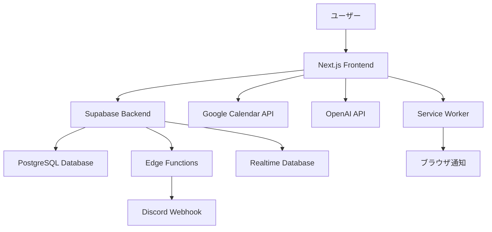

# 設計文書

## 概要

AIスケジュールアシスタントは、Google Calendar統合、AI駆動タスク提案、リアルタイム通知を提供するNext.js Webアプリケーションです。Supabaseをバックエンドとし、OpenAI GPT-4oによるインテリジェントなタスク管理機能を実装します。

## アーキテクチャ

### システム全体構成



### レイヤー構成

1. **プレゼンテーション層**: Next.js App Router + React Components
2. **ビジネスロジック層**: Supabase Edge Functions + Client-side Logic
3. **データアクセス層**: Supabase Client + PostgreSQL
4. **外部統合層**: Google Calendar API + OpenAI API + Discord Webhooks

## コンポーネントとインターフェース

### 1. 認証システム

**コンポーネント**: `AuthProvider`, `LoginPage`, `AuthGuard`

```typescript
interface AuthService {
  signInWithGoogle(): Promise<AuthResponse>
  signOut(): Promise<void>
  getCurrentUser(): User | null
  refreshToken(): Promise<string>
}

interface User {
  id: string
  email: string
  name: string
  googleAccessToken: string
  googleRefreshToken: string
}
```

### 2. カレンダー同期システム

**コンポーネント**: `CalendarSync`, `EventManager`, `SyncStatus`

```typescript
interface CalendarService {
  syncEvents(dateRange: DateRange): Promise<Event[]>
  getMonthEvents(year: number, month: number): Promise<Event[]>
  getTodaySchedule(): Promise<ScheduleItem[]>
  createEvent(event: CreateEventRequest): Promise<Event>
  updateEvent(eventId: string, updates: UpdateEventRequest): Promise<Event>
  deleteEvent(eventId: string): Promise<void>
  setupWebhook(): Promise<WebhookResponse>
}

interface CalendarWidgetService {
  generateMonthCalendar(year: number, month: number): Promise<CalendarDay[]>
  getTodayTimeline(): Promise<TimelineItem[]>
  getAvailableTimeSlots(date: Date): Promise<TimeSlot[]>
}

interface CalendarDay {
  date: number
  isToday: boolean
  isCurrentMonth: boolean
  hasEvents: boolean
  eventCount: number
}

interface TimelineItem {
  startTime: string
  endTime: string
  title: string
  location?: string
  type: 'meeting' | 'work' | 'break' | 'other'
  color: string
}

interface ScheduleItem {
  time: string
  title: string
  location?: string
  duration: number
  type: 'event' | 'task' | 'break'
}

interface Event {
  id: string
  gcalId: string
  title: string
  start: DateTime
  end: DateTime
  description?: string
  location?: string
  attendees?: string[]
}
```

### 3. AI提案システム

**コンポーネント**: `TaskSuggestionEngine`, `AIPromptManager`, `FeedbackCollector`

```typescript
interface AIService {
  generateTaskSuggestions(context: TaskContext): Promise<TaskSuggestion[]>
  generatePreparationTasks(event: Event): Promise<Task[]>
  analyzePriority(tasks: Task[], schedule: Event[]): Promise<PriorityAnalysis>
  processUserFeedback(feedback: UserFeedback): Promise<void>
}

interface TaskSuggestion {
  title: string
  description: string
  estimatedMinutes: number
  priority: 'high' | 'medium' | 'low'
  reasoning: string
  category: string
}

interface TaskContext {
  availableTimeSlots: TimeSlot[]
  currentTasks: Task[]
  recentCompletions: Task[]
  userPreferences: UserPreferences
}
```

### 4. タスク管理システム

**コンポーネント**: `TaskManager`, `TaskList`, `TaskForm`, `TaskAnalytics`

```typescript
interface TaskService {
  createTask(task: CreateTaskRequest): Promise<Task>
  updateTask(taskId: string, updates: UpdateTaskRequest): Promise<Task>
  deleteTask(taskId: string): Promise<void>
  getTasks(filters: TaskFilters): Promise<Task[]>
  completeTask(taskId: string): Promise<Task>
  rescheduleTask(taskId: string, newDate: Date): Promise<Task>
}

interface Task {
  id: string
  title: string
  description?: string
  estimatedMinutes: number
  actualMinutes?: number
  priority: Priority
  status: 'pending' | 'in_progress' | 'completed' | 'cancelled'
  dueDate?: Date
  scheduledDate?: Date
  category: string
  postponeCount: number
  createdAt: Date
  completedAt?: Date
}
```

### 5. 通知システム

**コンポーネント**: `NotificationManager`, `ServiceWorkerManager`, `DiscordService`

```typescript
interface NotificationService {
  scheduleNotification(notification: ScheduledNotification): Promise<void>
  sendImmediateNotification(notification: Notification): Promise<void>
  updateNotificationPreferences(preferences: NotificationPreferences): Promise<void>
  getNotificationHistory(): Promise<Notification[]>
}

interface DiscordService {
  sendNotification(message: string, webhookUrl: string): Promise<void>
  formatMessage(notification: Notification): DiscordMessage
}

interface DiscordMessage {
  content: string
  embeds?: DiscordEmbed[]
}

interface DiscordEmbed {
  title: string
  description: string
  color: number
  timestamp: string
}

interface Notification {
  id: string
  type: 'task_reminder' | 'event_reminder' | 'daily_summary' | 'mentor_suggestion'
  title: string
  message: string
  scheduledAt: Date
  sentAt?: Date
  channels: ('browser' | 'discord')[]
  priority: 'low' | 'normal' | 'high'
}

interface NotificationPreferences {
  discordWebhookUrl?: string
  enabledChannels: ('browser' | 'discord')[]
  quietHours: { start: string, end: string }
}
```

### 6. メンター分析システム

**コンポーネント**: `MentorAnalyzer`, `ProductivityTracker`, `InsightGenerator`, `AIChatService`

```typescript
interface MentorService {
  analyzeProductivity(period: DateRange): Promise<ProductivityAnalysis>
  generateInsights(userId: string): Promise<MentorInsight[]>
  suggestImprovements(analysis: ProductivityAnalysis): Promise<Improvement[]>
  trackProgress(userId: string): Promise<ProgressMetrics>
}

interface AIChatService {
  sendMessage(message: string, context: ChatContext): Promise<ChatResponse>
  getChatHistory(userId: string, limit?: number): Promise<ChatMessage[]>
  generateContextualResponse(userMessage: string, userContext: UserContext): Promise<string>
}

interface ChatContext {
  currentTasks: Task[]
  todayEvents: Event[]
  recentProductivity: ProductivityAnalysis
  userPreferences: UserPreferences
}

interface ChatMessage {
  id: string
  userId: string
  message: string
  response: string
  timestamp: Date
  context: ChatContext
}

interface ChatResponse {
  message: string
  suggestedActions?: string[]
  relatedTasks?: string[]
}

interface ProductivityAnalysis {
  completionRate: number
  averageTaskDuration: number
  postponeFrequency: number
  timeEstimationAccuracy: number
  peakProductivityHours: number[]
  strugglingAreas: string[]
}

interface MentorInsight {
  type: 'completion_rate' | 'time_estimation' | 'task_breakdown' | 'rest_suggestion'
  message: string
  actionable: boolean
  priority: number
  suggestedActions: string[]
}
```

## データモデル

### データベーススキーマ

```sql
-- ユーザー管理
CREATE TABLE users (
  id UUID PRIMARY KEY DEFAULT gen_random_uuid(),
  email VARCHAR(255) UNIQUE NOT NULL,
  name VARCHAR(255) NOT NULL,
  google_access_token TEXT,
  google_refresh_token TEXT,
  discord_webhook_url TEXT,
  preferences JSONB DEFAULT '{}',
  created_at TIMESTAMP WITH TIME ZONE DEFAULT NOW(),
  updated_at TIMESTAMP WITH TIME ZONE DEFAULT NOW()
);

-- イベント管理
CREATE TABLE events (
  id UUID PRIMARY KEY DEFAULT gen_random_uuid(),
  user_id UUID REFERENCES users(id) ON DELETE CASCADE,
  gcal_id VARCHAR(255),
  title VARCHAR(500) NOT NULL,
  description TEXT,
  start_time TIMESTAMP WITH TIME ZONE NOT NULL,
  end_time TIMESTAMP WITH TIME ZONE NOT NULL,
  location VARCHAR(255),
  attendees JSONB DEFAULT '[]',
  created_at TIMESTAMP WITH TIME ZONE DEFAULT NOW(),
  updated_at TIMESTAMP WITH TIME ZONE DEFAULT NOW()
);

-- タスク管理
CREATE TABLE tasks (
  id UUID PRIMARY KEY DEFAULT gen_random_uuid(),
  user_id UUID REFERENCES users(id) ON DELETE CASCADE,
  title VARCHAR(500) NOT NULL,
  description TEXT,
  estimated_minutes INTEGER NOT NULL,
  actual_minutes INTEGER,
  priority VARCHAR(10) CHECK (priority IN ('high', 'medium', 'low')),
  status VARCHAR(20) CHECK (status IN ('pending', 'in_progress', 'completed', 'cancelled')),
  category VARCHAR(100),
  due_date TIMESTAMP WITH TIME ZONE,
  scheduled_date TIMESTAMP WITH TIME ZONE,
  postpone_count INTEGER DEFAULT 0,
  event_id UUID REFERENCES events(id) ON DELETE SET NULL,
  created_at TIMESTAMP WITH TIME ZONE DEFAULT NOW(),
  completed_at TIMESTAMP WITH TIME ZONE
);

-- AI提案管理
CREATE TABLE suggestions (
  id UUID PRIMARY KEY DEFAULT gen_random_uuid(),
  task_id UUID REFERENCES tasks(id) ON DELETE CASCADE,
  ai_version VARCHAR(50) NOT NULL,
  suggestion_data JSONB NOT NULL,
  score DECIMAL(3,2),
  adopted BOOLEAN DEFAULT FALSE,
  user_feedback JSONB,
  created_at TIMESTAMP WITH TIME ZONE DEFAULT NOW()
);

-- 通知管理
CREATE TABLE notifications (
  id UUID PRIMARY KEY DEFAULT gen_random_uuid(),
  user_id UUID REFERENCES users(id) ON DELETE CASCADE,
  type VARCHAR(50) NOT NULL,
  title VARCHAR(255) NOT NULL,
  message TEXT NOT NULL,
  scheduled_at TIMESTAMP WITH TIME ZONE NOT NULL,
  sent_at TIMESTAMP WITH TIME ZONE,
  channels JSONB NOT NULL DEFAULT '["browser"]', -- browser, discord
  priority VARCHAR(10) DEFAULT 'normal',
  metadata JSONB DEFAULT '{}'
);

-- AIチャット履歴
CREATE TABLE chat_messages (
  id UUID PRIMARY KEY DEFAULT gen_random_uuid(),
  user_id UUID REFERENCES users(id) ON DELETE CASCADE,
  user_message TEXT NOT NULL,
  ai_response TEXT NOT NULL,
  context_data JSONB NOT NULL,
  created_at TIMESTAMP WITH TIME ZONE DEFAULT NOW()
);

-- 分析ログ
CREATE TABLE analytics_logs (
  id UUID PRIMARY KEY DEFAULT gen_random_uuid(),
  user_id UUID REFERENCES users(id) ON DELETE CASCADE,
  event_type VARCHAR(100) NOT NULL,
  event_data JSONB NOT NULL,
  created_at TIMESTAMP WITH TIME ZONE DEFAULT NOW()
);
```

### インデックス設計

```sql
-- パフォーマンス最適化用インデックス
CREATE INDEX idx_events_user_start ON events(user_id, start_time);
CREATE INDEX idx_tasks_user_status ON tasks(user_id, status);
CREATE INDEX idx_tasks_scheduled_date ON tasks(scheduled_date) WHERE scheduled_date IS NOT NULL;
CREATE INDEX idx_notifications_user_scheduled ON notifications(user_id, scheduled_at);
CREATE INDEX idx_chat_messages_user_created ON chat_messages(user_id, created_at);
CREATE INDEX idx_analytics_user_type_created ON analytics_logs(user_id, event_type, created_at);
```

### Row Level Security (RLS) ポリシー

```sql
-- 段階的実装：開発初期は基本フィルタリング、後にRLS完全実装
ALTER TABLE users ENABLE ROW LEVEL SECURITY;
ALTER TABLE events ENABLE ROW LEVEL SECURITY;
ALTER TABLE tasks ENABLE ROW LEVEL SECURITY;
ALTER TABLE suggestions ENABLE ROW LEVEL SECURITY;
ALTER TABLE notifications ENABLE ROW LEVEL SECURITY;
ALTER TABLE analytics_logs ENABLE ROW LEVEL SECURITY;

-- 基本ポリシー（フェーズ3で実装）
CREATE POLICY "Users can only access their own data" ON users
  FOR ALL USING (auth.uid() = id);

CREATE POLICY "Users can only access their own events" ON events
  FOR ALL USING (auth.uid() = user_id);

CREATE POLICY "Users can only access their own tasks" ON tasks
  FOR ALL USING (auth.uid() = user_id);

CREATE POLICY "Users can only access their own chat messages" ON chat_messages
  FOR ALL USING (auth.uid() = user_id);
```

## エラーハンドリング

### エラー分類と対応

1. **認証エラー**
   - Google OAuth失敗 → 再認証フローへ誘導
   - トークン期限切れ → 自動リフレッシュ

2. **API エラー**
   - Google Calendar API制限 → 指数バックオフで再試行
   - OpenAI API失敗 → GPT-3.5フォールバック

3. **データベースエラー**
   - 接続失敗 → キャッシュデータ表示
   - 制約違反 → ユーザーフレンドリーなメッセージ

4. **ネットワークエラー**
   - オフライン → Service Workerでキャッシュ対応
   - タイムアウト → 部分的データ表示

### エラーメッセージ設計

```typescript
interface ErrorMessage {
  code: string
  userMessage: string  // 日本語、非技術者向け
  technicalMessage: string
  suggestedActions: string[]
  recoverable: boolean
}

const ERROR_MESSAGES = {
  'GOOGLE_AUTH_FAILED': {
    userMessage: 'Googleアカウントでのログインに失敗しました。もう一度お試しください。',
    suggestedActions: ['ブラウザを更新する', 'ポップアップブロックを確認する']
  },
  'CALENDAR_SYNC_FAILED': {
    userMessage: 'カレンダーの同期に失敗しました。インターネット接続を確認してください。',
    suggestedActions: ['インターネット接続を確認', '数分後に再試行']
  },
  'DISCORD_NOTIFICATION_FAILED': {
    userMessage: 'Discord通知の送信に失敗しました。Webhook URLを確認してください。',
    suggestedActions: ['Discord Webhook URLを確認', 'Discordサーバーの権限を確認']
  }
}
```

## テスト戦略

### テストピラミッド

1. **単体テスト (70%)**
   - ビジネスロジック関数
   - ユーティリティ関数
   - データ変換処理

2. **統合テスト (20%)**
   - API統合
   - データベース操作
   - 外部サービス連携

3. **E2Eテスト (10%)**
   - 主要ユーザーフロー
   - クリティカルパス

### テスト実装

```typescript
// 単体テスト例
describe('TaskSuggestionEngine', () => {
  test('should generate appropriate task suggestions', async () => {
    const context: TaskContext = {
      availableTimeSlots: [{ start: '09:00', end: '10:00' }],
      currentTasks: [],
      recentCompletions: [],
      userPreferences: { preferredTaskLength: 30 }
    }
    
    const suggestions = await aiService.generateTaskSuggestions(context)
    
    expect(suggestions).toHaveLength(3)
    expect(suggestions[0].estimatedMinutes).toBeLessThanOrEqual(60)
    expect(suggestions[0].reasoning).toBeDefined()
  })
})

// E2Eテスト例
describe('Calendar Integration', () => {
  test('should sync events bidirectionally', async () => {
    // Google Calendarでイベント作成
    await createGoogleCalendarEvent('Test Meeting')
    
    // アプリで同期確認
    await page.goto('/dashboard')
    await expect(page.locator('[data-testid="event-Test Meeting"]')).toBeVisible()
    
    // アプリでイベント更新
    await page.click('[data-testid="edit-event"]')
    await page.fill('[data-testid="event-title"]', 'Updated Meeting')
    await page.click('[data-testid="save-event"]')
    
    // Google Calendarで更新確認
    const updatedEvent = await getGoogleCalendarEvent('Updated Meeting')
    expect(updatedEvent).toBeDefined()
  })
})
```

### パフォーマンステスト

```typescript
// k6 パフォーマンステスト
import http from 'k6/http'
import { check } from 'k6'

export let options = {
  stages: [
    { duration: '2m', target: 10 },
    { duration: '5m', target: 50 },
    { duration: '2m', target: 0 }
  ],
  thresholds: {
    http_req_duration: ['p(95)<300'], // 95%のリクエストが300ms以内
    http_req_failed: ['rate<0.1']     // エラー率10%未満
  }
}

export default function() {
  const response = http.get('https://app.example.com/api/tasks')
  check(response, {
    'status is 200': (r) => r.status === 200,
    'response time < 300ms': (r) => r.timings.duration < 300
  })
}
```